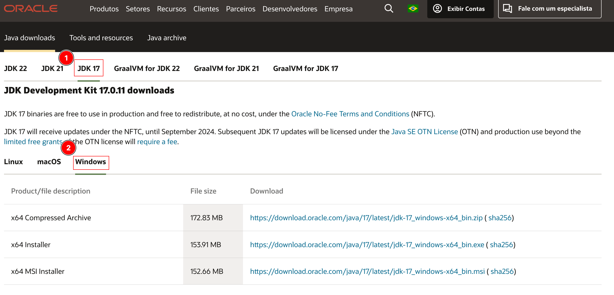
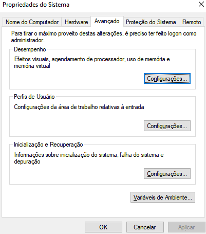
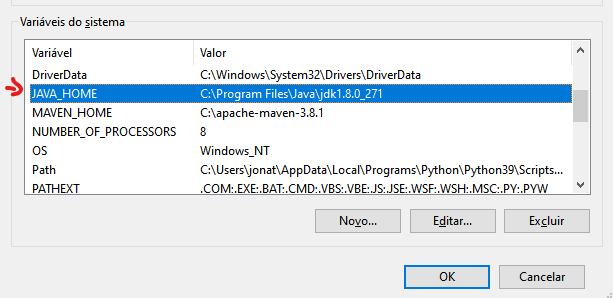
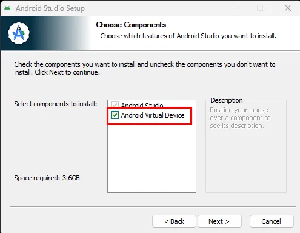
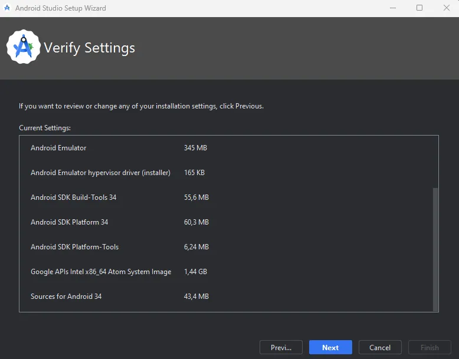
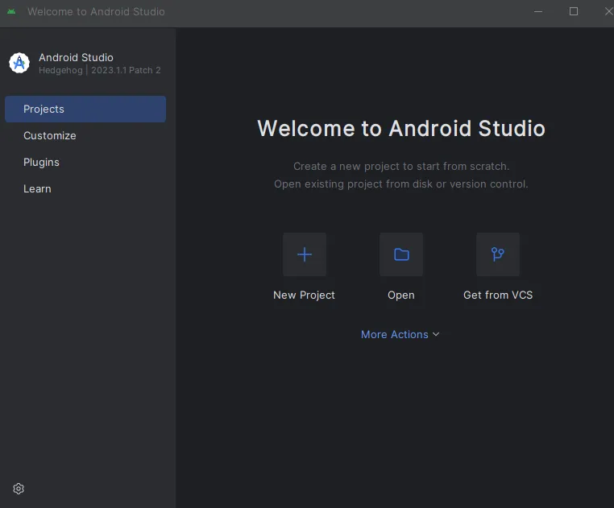
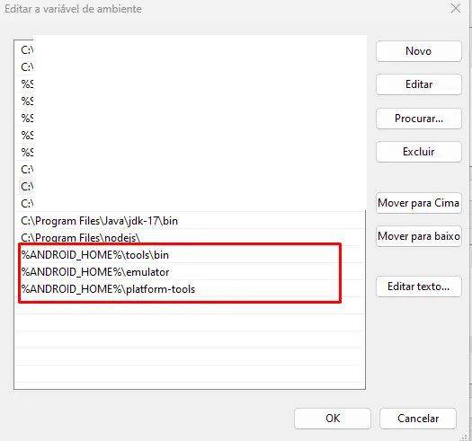

# Configuração Appium Windows

## Java JDK

1. Baixando o JDK através do [LINK](https://www.oracle.com/br/java/technologies/downloads/#jdk17-windows)
   - Instale a versão do java jdk 17 para esse projeto.  
2. Realize a instalação do jdk baixado e siga o passo a passo.
3. Variáveis de ambiente
   - Agora vamos configurar as variáveis de ambiente, para isso abra o menu iniciar e pesquise por "Editar as variáveis de ambiente do sistema"
   
   - Clique na aba "Avançado" >> [Variáveis de Ambiente...]
   
   - Nas 'Variáveis de ambiente', de um duplo clique sobre a váriavel "path" >> [Novo]
   - Adicione o 'bin' do JDK instalado e clique em [OK]
     - Por padrão o diretório é **"C:\Program Files\Java\jdk-17\bin"**, verifique o diretório da sua máquina.
   - Adicione a variável **JAVA_HOME** nas **"Variáveis de ambiente do usuário"** com o diretório do Jdk instalado. **Exemplo**: **"C:\Program Files\Java\jdk-17"**
    
    *Imagem meramente ilustrativa*
   - Clique em [OK] e confirme as alterações

## NVM (Node version manager) e Node.js

1. **Baixar o NVM para Windows**
   - Abra o navegador e vá para a página de releases do NVM no GitHub: [NVM for Windows Releases](https://github.com/coreybutler/nvm-windows/releases).
   - Na seção "**Assets**", encontre o arquivo **nvm-setup.zip** na versão mais recente e clique nele para fazer o download.
2. **Instalar o NVM**
   - Após o download estar completo, abra o arquivo **nvm-setup.zip**
   - Extraia o conteúdo do arquivo zip para uma pasta de sua escolha. Por exemplo, você pode extrair para C:\nvm para manter as coisas simples.
   - Navegue até a pasta onde você extraiu o NVM. Dentro dela, você deve ver um arquivo executável chamado **nvm-setup.exe**.
   - Execute **nvm-setup.exe** como administrador. Você pode fazer isso clicando com o botão direito do mouse no arquivo e selecionando "Executar como administrador".
   - Siga as instruções do instalador para completar a instalação do NVM. Durante a instalação, você pode deixar as opções padrão ou ajustá-las conforme necessário.
3. **Configurar o NVM**
   - Após a instalação, abra o Prompt de Comando do Windows como administrador. Isso é importante para evitar problemas de permissão ao instalar versões do Node.js.
   - Para verificar se o NVM foi instalado corretamente, digite o seguinte comando: ``nvm version`` (Isso deve exibir a versão do NVM instalada.)
4. **Instalando versão especifica do Node.js**
   - Vamos instalar a versão do node.js ``18.17.0``, para isso, use o comando ``nvm install 18.17.0``
   - Após a instalação, você pode verificar se o Node.js foi instalado corretamente digitando: ``node -v`` (Isso deve exibir a versão do Node.js instalada.)

## Android Studio

1. Baixe o [Android Studio](https://developer.android.com/studio?hl=pt-br)
2. Execute o instalador em sua máquina, e lembre de marcar a opção de **'Android Virtual Device'** deve estar marcada.

3. Após instalar, abra o Android Studio e marque a opção **“Do not import settings”**
4. Clique em **[Don't send]**
5. Clique em **[Next]**
6. Clique em **[Next]**
7. É exibido a tela de verificação para instalação de algumas depêndencias.

8. Clique em **[Next]**
9. Marque a opção **“Accept”** e depois clique em **“Finish”**
10. Após instalação, é exibida a tela inicial do Android Studio

11. Clique em **[More Actions] >> [Sdk Manager]**, está tela exibe o diretório do sdk do android no campo 'Android SDK Locations'. Confirme se o campo está preenchido (*COPIE O VALOR PARA MAIS TARDE*), caso sim, clique em [OK]
12. Clique novamente em **[More Actions] >> [Virtual Device Manager] >> clique no ícone [+] e para configuração padrão clique em [Next]** e configure o device.
13. Pronto, device configurado. 
14. Agora, clique no ícone de [play] do device criado para inicia-lo.
15. Variáveis de ambiente
  - Agora vamos configurar as variáveis de ambiente, para isso abra o menu iniciar e pesquise por "Editar as variáveis de ambiente do sistema"
  - Clique na aba "Avançado" >> [Variáveis de Ambiente...]
  - Nas 'Variáveis de Sistema' e clique em [Novo]
  - No campo 'Nome da variável' informe o valor "ANDROID_HOME"
  - No campo 'Valor da variável' informe o valor do **'PASSO 11'**
  - Clique em [OK]
  - Ainda nas variáveis de sistema, de um DUPLO CLICK sobre a variável do 'Path' >> clique em [Novo]
  - Adicione as seguintes variáveis
    - %ANDROID_HOME%\tools\bin
    - %ANDROID_HOME%\emulator
    - %ANDROID_HOME%\platform-tools
    
  - Clique em [OK]

*UFA PRONTO ATÉ AQUI :)*

## Appium

## Referências

- [Configuração ambiente WINDOWS para testes mobile ANDROID utilizando APPIUM — PARTE-1](https://medium.com/@adrianoaluizi/configura%C3%A7%C3%A3o-ambiente-windows-para-testes-mobile-android-utilizando-appium-parte-1-a126c409c6d0)
- [Configuração ambiente WINDOWS para testes mobile ANDROID utilizando APPIUM — PARTE-2](https://medium.com/@adrianoaluizi/configura%C3%A7%C3%A3o-ambiente-windows-para-testes-mobile-android-utilizando-appium-parte-2-3c966ec814b2)
- [Configurando Android Studio no Windows para testes manuais de APP](https://pt.linkedin.com/pulse/configurando-android-studio-windows-para-testes-de-martins-faria)