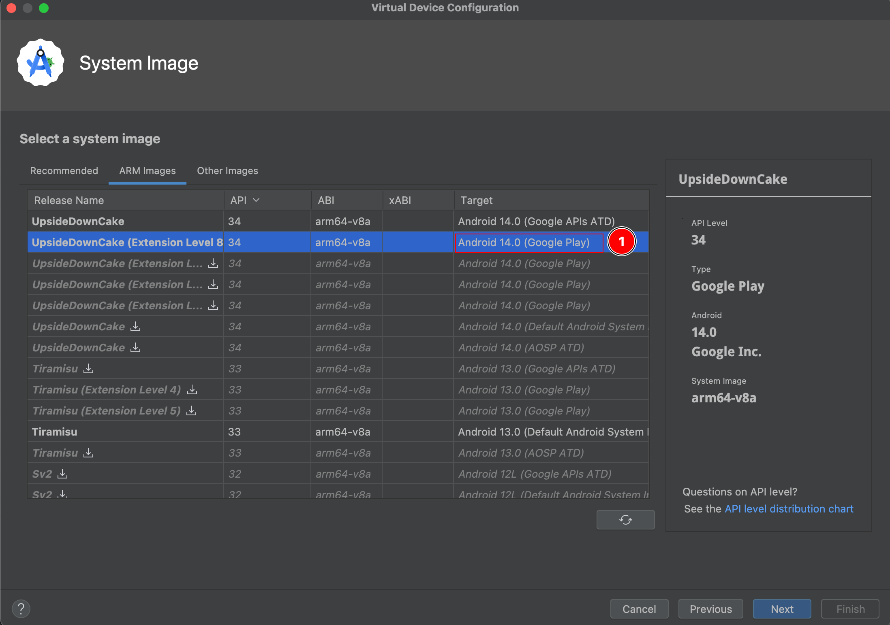

# Aula 01

## **Passo 1:** Execute o comando abaixo para iniciar o projeto

```sh {"id":"01J2FPBY8DRM7N529RFSQY4B0V"}
npm init wdio@latest .
```

**Retorno no terminal**

````````text {"id":"01J2FNQ0YAAQDFECY26K1QFHEN"}
➜  aula-01 git:(main) ✗ npm init wdio@latest .

                 -:...........................-:.
                 +                              +
              `` +      `...`        `...`      + `
            ./+/ +    .:://:::`    `::///::`  ` + ++/.
           .+oo+ +    /:+ooo+-/    /-+ooo+-/ ./ + +oo+.
           -ooo+ +    /-+ooo+-/    /-+ooo+-/ .: + +ooo.
            -+o+ +    `::///:-`    `::///::`    + +o+-
             ``. /.     `````        `````     .: .``
                  .----------------------------.
           `-::::::::::::::::::::::::::::::::::::::::-`
          .+oooo/:------------------------------:/oooo+.
      `.--/oooo-                                  :oooo/--.`
    .::-``:oooo`                                  .oooo-``-::.
  ./-`    -oooo`--.: :.--                         .oooo-    `-/.
 -/`    `-/oooo////////////////////////////////////oooo/.`    `/-
`+`   `/+oooooooooooooooooooooooooooooooooooooooooooooooo+:`   .+`
-/    +o/.:oooooooooooooooooooooooooooooooooooooooooooo:-/o/    +.
-/   .o+  -oooosoooososssssooooo------------------:oooo- `oo`   +.
-/   .o+  -oooodooohyyssosshoooo`                 .oooo-  oo.   +.
-/   .o+  -oooodooysdooooooyyooo` `.--.``     .:::-oooo-  oo.   +.
-/   .o+  -oooodoyyodsoooooyyooo.//-..-:/:.`.//.`./oooo-  oo.   +.
-/   .o+  -oooohsyoooyysssysoooo+-`     `-:::.    .oooo-  oo.   +.
-/   .o+  -ooooosooooooosooooooo+//////////////////oooo-  oo.   +.
-/   .o+  -oooooooooooooooooooooooooooooooooooooooooooo-  oo.   +.
-/   .o+  -oooooooooooooooooooooooooooooooooooooooooooo-  oo.   +.
-+////o+` -oooo---:///:----://::------------------:oooo- `oo////+-
+ooooooo/`-oooo``:-```.:`.:.`.+/-    .::::::::::` .oooo-`+ooooooo+
oooooooo+`-oooo`-- `/` .:+  -/-`/`   .::::::::::  .oooo-.+oooooooo
+-/+://-/ -oooo-`:`.o-`:.:-````.:    .///:``````  -oooo-`/-//:+:-+
: :..--:-:.+ooo+/://o+/-.-:////:-....-::::-....--/+ooo+.:.:--.-- /
- /./`-:-` .:///+/ooooo/+///////////////+++ooooo/+///:. .-:.`+./ :
:-:/.           :`ooooo`/`              .:.ooooo :           ./---
                :`ooooo`/`              .:.ooooo :
                :`ooooo./`              .:-ooooo :
                :`ooooo./`              .:-ooooo :
            `...:-+++++:/.              ./:+++++-:...`
           :-.````````/../              /.-:````````.:-
          -/::::::::://:/+             `+/:+::::::::::+.
          :oooooooooooo++/              +++oooooooooooo-
 
                           Webdriver.IO
              Next-gen browser and mobile automation
                    test framework for Node.js


===============================
🤖 WDIO Configuration Wizard 🧙
===============================

? A project named "aula-01" was detected at "/Users/jonatasmartins/Documents/estudos/q
a.wikipedia-test-e2e.webdriverio/02-course-javascript-mobile-automation/aula-01", 
correct? Yes
? What type of testing would you like to do? E2E Testing - of Web or Mobile 
Applications
? Where is your automation backend located? On my local machine
? Which environment you would like to automate? Mobile - native, hybrid and mobile web
 apps, on Android or iOS
? Which mobile environment yould like to automate? Android - native, hybrid and mobile web apps, tested on emulators and real devices using UiAutomator2 (https://www.npmjs.com/package/appium-uiautomator2-driver)
? Which framework do you want to use? Mocha (https://mochajs.org/)
? Do you want to use a compiler? Babel (https://babeljs.io/)
? Do you want WebdriverIO to autogenerate some test files? Yes
? What should be the location of your spec files? 
/Users/jonatasmartins/Documents/estudos/qa.wikipedia-test-e2e.webdriverio/02-course-ja
vascript-mobile-automation/aula-01/test/specs/**/*.js
? Do you want to use page objects (https://martinfowler.com/bliki/PageObject.html)? Yes
? Where are your page objects located? /Users/jonatasmartins/Documents/estudos/qa.wikipedia-test-e2e.webdriverio/02-course-javascript-mobile-automation/aula-01/test/pageobjects/**/*.js
? Which reporter do you want to use? spec
? Do you want to add a plugin to your test setup? 
? Do you want to add a service to your test setup? appium
? Do you want me to run `npm install` Yes

Setting up Babel project...
✔ Success!

Installing packages using npm:
- @wdio/local-runner@latest
- @wdio/mocha-framework@latest
- @wdio/spec-reporter@latest
- @wdio/appium-service@latest
- @babel/register
- @babel/core
- @babel/preset-env
- appium-uiautomator2-driver

Run `npm audit` for details.
✔ Success!

Creating a WebdriverIO config file...
✔ Success!

Autogenerating test files...
✔ Success!

Adding "wdio" script to package.json
✔ Success!

🤖 Successfully setup project at /Users/jonatasmartins/Documents/estudos/qa.wikipedia-test-e2e.webdriverio/02-course-javascript-mobile-automation/aula-01 🎉

Join our Discord Community Server and instantly find answers to your issues or queries. Or just join and say hi 👋!
  🔗 https://discord.webdriver.io

Visit the project on GitHub to report bugs 🐛 or raise feature requests 💡:
  🔗 https://github.com/webdriverio/webdriverio

To run your tests, execute:
$ cd /Users/jonatasmartins/Documents/estudos/qa.wikipedia-test-e2e.webdriverio/02-course-javascript-mobile-automation/aula-01
$ npm run wdio

? Continue with Appium setup using appium-installer 
(https://github.com/AppiumTestDistribution/appium-installer)? (Y/n) 

```
````````

## **Passo 2:** Informe 'Y' para verificar as instalações do appium na sua maquina ou 'n' para não verificar.

- Aqui informei 'n'

## **Passo 3:** Abra o emulador ou conecte o device no computador

## **Passo 4:** Execute o comando abaixo

```sh {"id":"01J2FPBY8DRM7N529RFWS01GCZ"}
npm run wdio
```

### **Possivéis erros:**

1. PlataformVersion incorreta para a versão do emulador ou device conectado.

```text {"id":"01J2PBEC1GK24XXMC5X8C00BP3"}
ERROR webdriver: Request failed with status 500 due to unknown error: An unknown server-side error occurred while processing the command. Original error: Unable to find an active device or emulator with OS 12.0. The following are available: emulator-5554 (10)
```

- **Solução**: Abra o arquivo do wdio.conf.js e altere o plataformVersion para a versão correta do android do seu dispositivo/emulador conectado.

```javascript {"id":"01J2PBEC1GK24XXMC5XBFGESQK"}
    capabilities: [{
        // capabilities for local Appium web tests on an Android Emulator
        platformName: 'Android',
        browserName: 'Chrome',
        'appium:deviceName': 'Android GoogleAPI Emulator',
        'appium:platformVersion': '12.0', /* Adicione a versão correta aqui*/
        'appium:automationName': 'UiAutomator2'
    }],
```

2. Download do google chrome para execução do teste web no device

```text {"id":"01J2PBEC1GK24XXMC5XDPEJ0F1"}
ERROR @wdio/runner: Error: Failed to create session.
[0-0] An unknown server-side error occurred while processing the command. Original error: No Chromedriver found that can automate Chrome '91.0.4472'. You could also try to enable automated chromedrivers download as a possible workaround.
```

- **Solução**:

3. Ao executar o teste no emulador é exibido o erro abaixo porque o navegador do chrome não está instalado

```text {"id":"01J2S8J1YSDTTZ6TZWT9HKQG5C"}
An unknown server-side error occurred while processing the command. Original error: Either provide 'app' option to install 'com.android.chrome' or consider setting 'noReset' to 'true' if 'com.android.chrome' is supposed to be preinstalled.
```

- **Solução**: Uma opção é instalar o APK do google chrome e a outra é configurar um emulador com google play. **Obs.:** O android 14 e 13 estão com problema, por isso ao criar um emulador, prefira um na versão 12 Google Play.
   

## **Passo 5:** Duplique o arquivo wdio.conf.js, criando mais dois arquivos 'wdio.device.conf.js' e 'wdio.emulator.conf.js'.

### wdio.device.conf.js

```json {"id":"01J2S8J1YSDTTZ6TZWTA74DHAH"}
    capabilities: [{
        // capabilities for local Appium web tests on an Android Emulator
        platformName: 'Android', /* Plataforma */
        browserName: 'Chrome', /* Navegador utilizado para teste */
        'appium:deviceName': 'Android GoogleAPI Emulator',
        'appium:platformVersion': '12.0', /* Versão do device utilizado */
        'appium:automationName': 'UiAutomator2',
        "appium:unicodeKeyboard": true /* Desativar o teclado do device */
    }],
```

### wdio.emulator.conf.js

```json {"id":"01J2S8J1YSDTTZ6TZWTDJJ8ERD"}
    capabilities: [{
        // capabilities for local Appium web tests on an Android Emulator
        platformName: 'Android', /* Plataforma */
        browserName: 'Chrome', /* Navegador utilizado para teste */
        'appium:fullReset': false, /* Se o aplicativo estiver instaldo, ele não apaga para reinstalar no device. */
        'appium:deviceName': 'Android GoogleAPI Emulator',
        'appium:platformVersion': '12.0', /* Versão do device utilizado */
        'appium:automationName': 'UiAutomator2',
        'appium:executable': path.resolve(`./node_modules/appium-chromedriver/chromedriver/${os}/chromedriver-${os}-arm64_v126.0.6478`) /* Caminho para pegar o arquivo do chrome para instalar no device caso necessário. Obs.: Necessário a dependência do 'appium-chromedriver'. */
    }],
```

## **Passo 6:** No arquivo package.json crie dois scripts para executar o teste no device e no emulador.

```json {"id":"01J2S8J1YSDTTZ6TZWTFKJYXNY"}
{
  "name": "aula-01",
  "type": "module",
  "devDependencies": {
    "@babel/core": "^7.24.7",
    "@babel/preset-env": "^7.24.7",
    "@babel/register": "^7.24.6",
    "@wdio/appium-service": "^8.39.1",
    "@wdio/local-runner": "^8.39.1",
    "@wdio/mocha-framework": "^8.39.0",
    "@wdio/spec-reporter": "^8.39.0",
    "appium-uiautomator2-driver": "^3.7.2"
  },
  "scripts": {
    "real-device": "wdio run ./wdio.device.conf.js",
    "emulator": "wdio run ./wdio.emulator.conf.js"
  },
  "dependencies": {
    "appium": "^2.11.2",
    "appium-chromedriver": "^5.6.63"
  }
}

```


